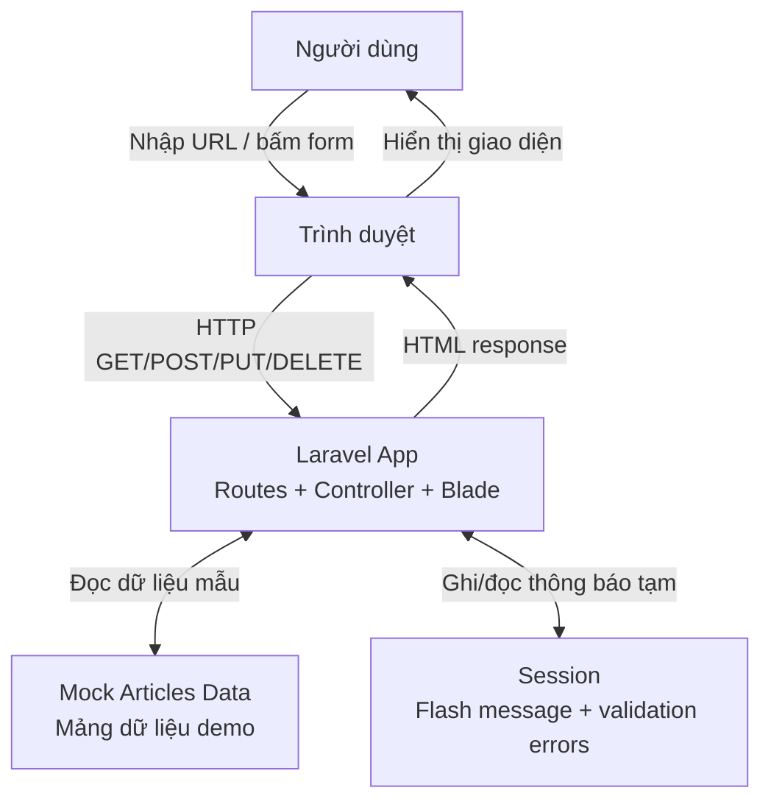
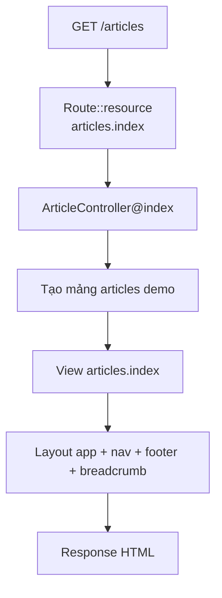
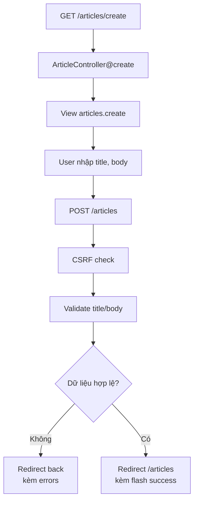
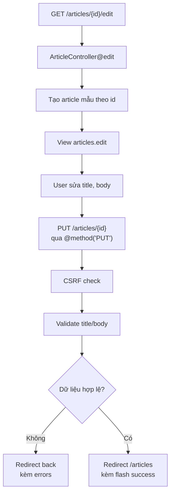
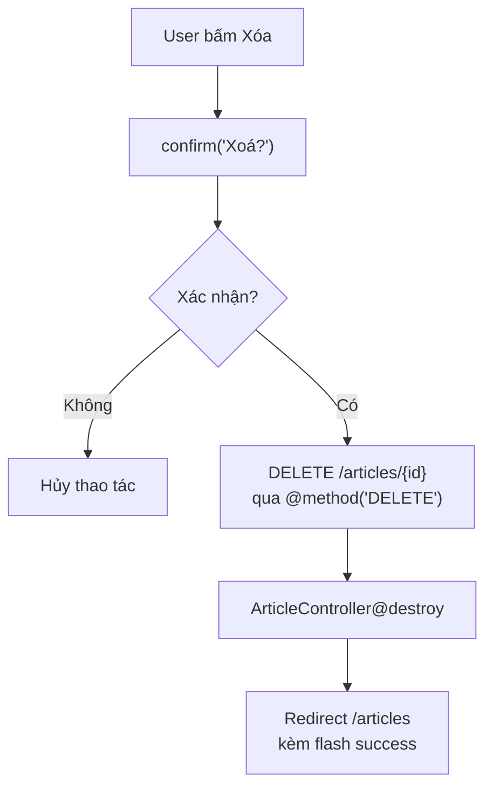
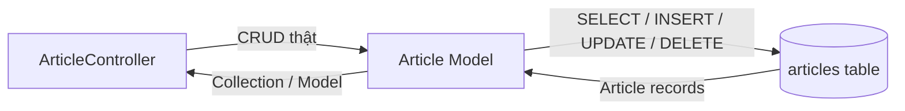

# Luồng dữ liệu - Module Articles

Tài liệu này bổ sung phần vẽ luồng dữ liệu cho Lab 7. Vì bài hiện tại chỉ demo Routing, Controller, Blade và Form nên dữ liệu bài viết đang được mô phỏng bằng mảng trong `ArticleController`, chưa lưu database.

## 1. DFD mức ngữ cảnh

## 2. Luồng xem danh sách bài viết

## 3. Luồng tạo bài viết

## 4. Luồng sửa bài viết

## 5. Luồng xóa bài viết

## 6. Ghi chú triển khai sau này

Khi học tới Migration và Eloquent, khối `Mock Articles Data` sẽ được thay bằng bảng `articles` trong database:

